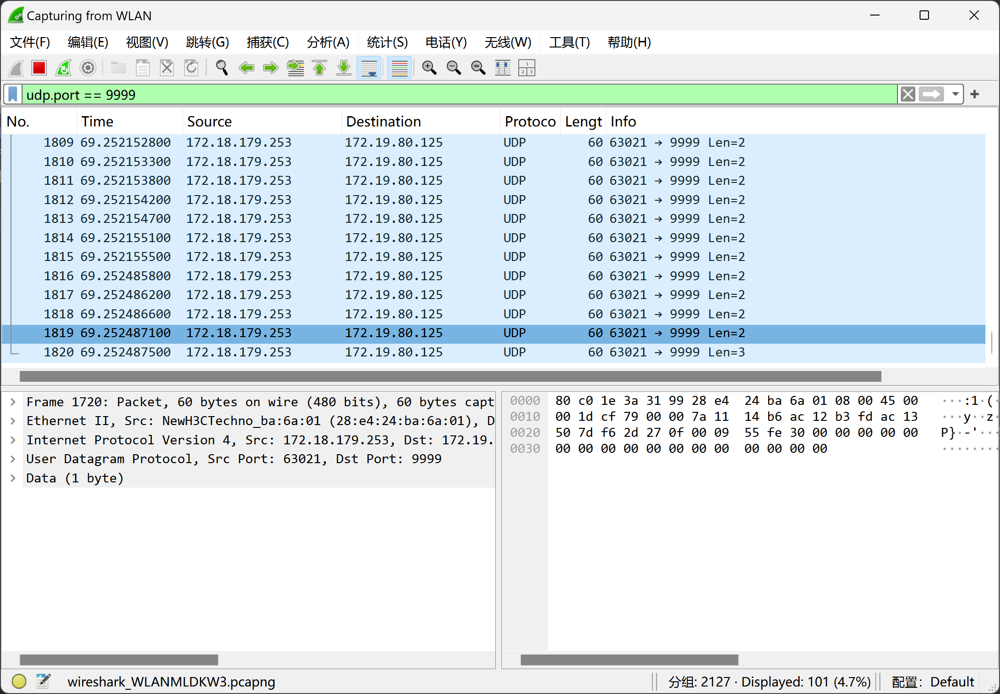
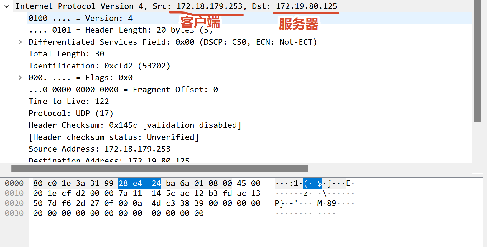
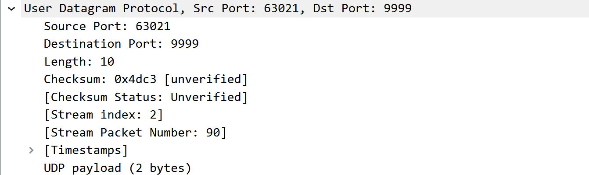
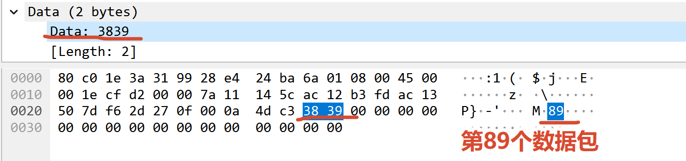

# 网络编程实验个人心得体会

| 项目     | 内容                             |
| -------- | -------------------------------- |
| 院系     | 计算机学院                       |
| 班级     | 计科 1 班                        |
| 学号     | 24319050                         |
| 姓名     | 韩宇                             |
| 实验名称 | 实验 1 UDP 通信程序设计          |
| 小组分工 | 成员 3：Wireshark 抓包与协议分析 |

## 一、本人承担的工作

本次实验中，我主要负责使用 Wireshark 抓取 UDP 通信数据包，分析 IP 层、UDP 层及 Data 字段，整理相关截图，并完成实验思考第（3）、（6）题。我的工作重点是将程序中的地址、端口和发送内容与实际报文对应起来，为实验提供协议层面的分析依据。

### 1. 抓包与过滤

实验在 Windows 环境下进行，服务器使用 UDP 9999 端口接收客户端发送的序号数据。我在服务器端选择实际用于通信的 WLAN 网卡，在客户端开始发送前启动抓包，并使用以下显示过滤条件筛选实验报文：

```wireshark
udp.port == 9999
```

这个条件会显示源端口或目的端口为 9999 的 UDP 报文，便于从同时存在的其他网络流量中定位本次实验通信。过滤后的列表中可以看到客户端向服务器连续发送的数据报，目标端口均为 9999。截图显示了 101 条过滤结果，与本轮发送 100 个序号数据报及一个 END 结束报文的数量相符。不过，报文总数只能作为辅助核对，是否丢包还需要结合序号和服务器的接收统计判断。



### 2. IP 层和 UDP 层分析

我选取携带序号 89 的报文作为分析样本，依次展开 Internet Protocol Version 4 和 User Datagram Protocol，记录关键字段及其含义。

| 层次 | 字段                | 截图中的值     | 分析                                         |
| ---- | ------------------- | -------------- | -------------------------------------------- |
| IPv4 | Source Address      | 172.18.179.253 | 抓包位置观察到的发送方 IP                    |
| IPv4 | Destination Address | 172.19.80.125  | 服务器 IP                                    |
| IPv4 | Protocol            | UDP（17）      | IP 数据部分承载 UDP 报文                     |
| IPv4 | Total Length        | 30 字节        | 包括 20 字节 IPv4 首部和 10 字节 UDP 报文    |
| UDP  | Source Port         | 63021          | 本次发送端使用的临时端口                     |
| UDP  | Destination Port    | 9999           | 服务器绑定的接收端口                         |
| UDP  | Length              | 10 字节        | 8 字节 UDP 首部加 2 字节数据                 |
| UDP  | Checksum            | 0x4dc3         | 本报文的 UDP 校验和值，截图状态为 Unverified |





通过这些字段，可以看出 IP 地址和端口号各自承担的作用：IP 地址用于定位网络中的主机，端口号用于将数据交给主机中的相应应用。服务器固定监听 9999 端口，而客户端没有显式绑定固定端口，因此操作系统为其分配临时端口，本次截图中的值是 63021。

### 3. Data 字段分析与截图整理

在 Data 字段中，样本报文显示两字节数据 `38 39`。它们分别是字符 `8` 和 `9` 的 ASCII 编码，对应程序发送的字符串 `"89"`。因此，这里的两字节是十进制序号的文本表示，不能直接将 `0x3839` 当作程序发送的整数序号。



这个样本区分了不同层次的长度：Data 的 Length 为 2，UDP 的 Length 为 10，IPv4 的 Total Length 为 30。它们分别统计不同范围的内容，并不矛盾。序号从 0 开始，因而截图中的“89”应准确称为“序号 89”，而不是直接称为第 89 个发送的数据包。

整理截图时，过滤结果、IP 层、UDP 层和 Data 字段分别配有说明。

### 4. 实验思考第（3）题

本实验的 UDP 服务器主要使用 `socket()`、`bind()`、`recvfrom()` 和 `close()`；客户端主要使用 `socket()`、`sendto()` 和 `close()`。两端都创建数据报套接字，但服务器需要绑定约定的本地端口，客户端则在发送时指定服务器地址。`recvfrom()` 除了返回数据，还会返回发送方的 IP 和端口，便于服务器识别报文来源。

对于题目中的 `struct sockaddr *addr`，我理解它是 Socket API 接收地址参数的通用形式。通用结构中的 `sa_family` 表示地址族，`sa_data` 保存与具体地址族有关的地址信息。IPv4 编程通常使用 `sockaddr_in` 保存地址，再将其指针转换为 `sockaddr *` 传给相应函数。其中，`sin_family` 为 `AF_INET`，`sin_port` 为网络字节序的端口号，`sin_addr` 为 IPv4 地址，`sin_zero` 是通常置零的填充字段。在 C 中设置端口时，可以用 `htons(9999)` 完成字节序转换。

结合本实验，服务器调用 `bind(("0.0.0.0", 9999))`，表示在本机所有 IPv4 网络接口上绑定 UDP 9999 端口。`0.0.0.0` 是绑定时使用的通配地址，实际数据报中的目的 IP 仍为 `172.19.80.125`。客户端调用 `sendto()` 时使用的目标地址则是 `("172.19.80.125", 9999)`。Python 将底层地址结构封装为元组，使程序可以直接使用 IP 字符串和端口整数。

`bind()` 的地址参数表示本地地址，`connect()` 的地址参数表示远端通信对象。本次 UDP 程序没有调用 `connect()`，而是直接通过 `sendto()` 指定目的地址。UDP 套接字也可以调用 `connect()` 设置默认通信对象，但这不代表进行了 TCP 式的握手，也不会因此获得可靠传输保证。

### 5. 实验思考第（6）题

从可靠性、协议开销和应用需求三个方面比较 TCP 与 UDP。TCP 提供可靠、有序的字节流传输，并具有重传、流量控制和拥塞控制机制，适用于文件传输、电子邮件、远程登录等需要完整交付数据的应用。不过，建立连接和维护状态需要开销，丢失数据后的重传也可能增加等待时间。

UDP 无须预先建立连接，首部较小，每个数据报独立传输，适用于 DNS 查询、实时音视频及网络游戏等场景。但它不保证数据到达和到达顺序，也不提供自动重传；应用若需要额外的可靠性或拥塞控制，需要自行设计相关机制。因此，协议选择需要结合应用目标，不能仅凭“UDP 开销小”就认定它在所有场景下都更合适。

小组报告记录，100 包实验中服务器接收了 100 包，丢包率为 0%；扩大到 10000 包后，接收 8049 包，缺失 1951 包，丢包率为 19.51%。前一次没有丢包，只能说明该轮实验的数据成功到达，不能说明 UDP 保证可靠传输。后一次结果则更清楚地看到，发送完成与接收完整是两个需要分别验证的事实。

## 二、遇到的困难及解决方法

### 1. 从抓包列表中定位实验流量

抓包列表中包含大量其他通信，直接浏览不容易定位实验数据。我采用先确认通信网卡、再使用 `udp.port == 9999` 显示过滤器的方法，并进一步检查目的 IP 和端口是否与服务器一致。这让我认识到，过滤条件负责缩小范围，报文字段负责核对通信对象，两者需要结合使用。

### 2. 报文解码失误

编程过程中，我曾将 `data.decode()` 写成 `data.decode`，导致变量保存的是方法对象，无法传给 `int()`。修正后，我理解了 Socket 接收的数据是字节序列，需要先解码为字符串，再转换为整数序号。我还一度混淆发送端的 `SERVER_IP` 与接收端 `recvfrom()` 返回的 `addr`，后来通过 Wireshark 的源地址和目的地址字段确认，`SERVER_IP` 是接收端地址，而 `addr` 表示发送方地址。

### 3. 准确解释校验和状态

样本中虽然显示了 Checksum 值，但其状态为 `Unverified`。整理分析时，我将“存在校验和值”和“Wireshark 已验证校验和”区分开来，没有把该状态写成校验成功或校验错误。校验和用于检测传输中的数据错误，但它本身也不等于确认应答、重传或可靠交付机制。

## 三、体会与总结

这次实验让我将 Socket API 与网络报文联系了起来。过去我主要从函数定义理解 `bind()`、`sendto()` 和 `recvfrom()`；通过抓包，我能够进一步看到固定服务器端口、客户端临时端口和程序发送的文本在报文中如何呈现。对协议的理解也从概念描述变成了可以逐字段检查的过程。

我也认识到，协议分析需要区分观察结果和原因解释。源 IP、目标端口、数据内容及接收数量都是可以从材料中核对的事实；至于大量发送时为什么出现缺失，还需要结合网络状况、接收缓冲区和程序处理速度进一步验证，不能仅凭一次结果就确定原因。抓包记录与应用层日志互相补充，才能形成较完整的实验依据。

在小组协作中，我负责将抓包现象整理为可读的截图说明，并用这些证据支撑地址参数解释和 TCP、UDP 的比较。今后进行类似实验时，我会更注意保留原始 `.pcapng` 文件，并记录每轮实验的时间、地址、端口、发送数量和接收结果。截图用于展示关键字段，原始抓包用于继续核查细节，两者结合能够提高报告的可复核性。

本次工作使我熟悉了 Wireshark 的接口选择、显示过滤和分层报文查看方法，也加深了对 UDP 数据报结构及其可靠性边界的理解。
